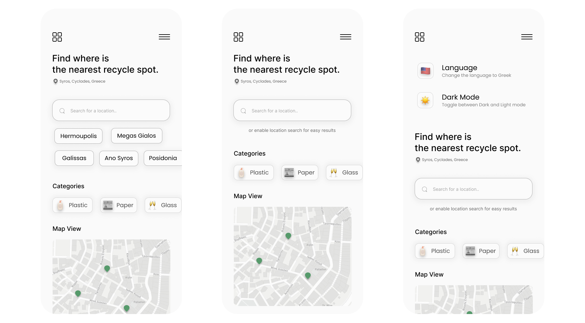

# Syros Location App 

A rough idea about how it will look like

### What is this

This is an app that shows on the map different and useful information about the island of Syros. Things like recycle bins, potable water supply locations, bus stations and more.

### The idea behind this 

As every project, the idea behind this one started from an real life problem that bothered me and I wanted to find a solution. I needed to recycle some old stuff and I didn't know where the bin were. And that was enough.

### Technologies used

- mapbox-gl
- firebase
- react-firebase-hooks
- react-router-dom
- react-transition-group 
- swiperjs

### What I learned 

- I learned how to use mapbox and what to avoid (for anyone reading this DON'T USE MAPBOX WRAPPERS FOR REACT. IT'S COMPLICATED AND IT DOES NOT WORTH THE TROUBLE).

- Always prototyping the project before start coding, it saves you a lot of time.

- I was looking for a way to animate different routes and my first thought of course was to use the amazing [react-transition-group](http://reactcommunity.org/react-transition-group/) library. But animating routes is a bit trickier as it turns out. The exit transition never gets a change to execute itself because the switch component just replace the previous route immediately. You can read more about that [here](https://css-tricks.com/animating-between-views-in-react/). After many frustrating days the solution was simple, just use the 'SwitchTransition' instead of the 'TransitionGroup'... It took me some time to even think about it because in all my googling it never came up. The moral in that story is always read at the docs first people!
  
### MIT License

Copyright (c) 2021 John Roussos

Permission is hereby granted, free of charge, to any person obtaining a copy
of this software and associated documentation files (the "Software"), to deal
in the Software without restriction, including without limitation the rights
to use, copy, modify, merge, publish, distribute, sublicense, and/or sell
copies of the Software, and to permit persons to whom the Software is
furnished to do so, subject to the following conditions:

The above copyright notice and this permission notice shall be included in all
copies or substantial portions of the Software.

THE SOFTWARE IS PROVIDED "AS IS", WITHOUT WARRANTY OF ANY KIND, EXPRESS OR
IMPLIED, INCLUDING BUT NOT LIMITED TO THE WARRANTIES OF MERCHANTABILITY,
FITNESS FOR A PARTICULAR PURPOSE AND NONINFRINGEMENT. IN NO EVENT SHALL THE
AUTHORS OR COPYRIGHT HOLDERS BE LIABLE FOR ANY CLAIM, DAMAGES OR OTHER
LIABILITY, WHETHER IN AN ACTION OF CONTRACT, TORT OR OTHERWISE, ARISING FROM,
OUT OF OR IN CONNECTION WITH THE SOFTWARE OR THE USE OR OTHER DEALINGS IN THE
SOFTWARE.